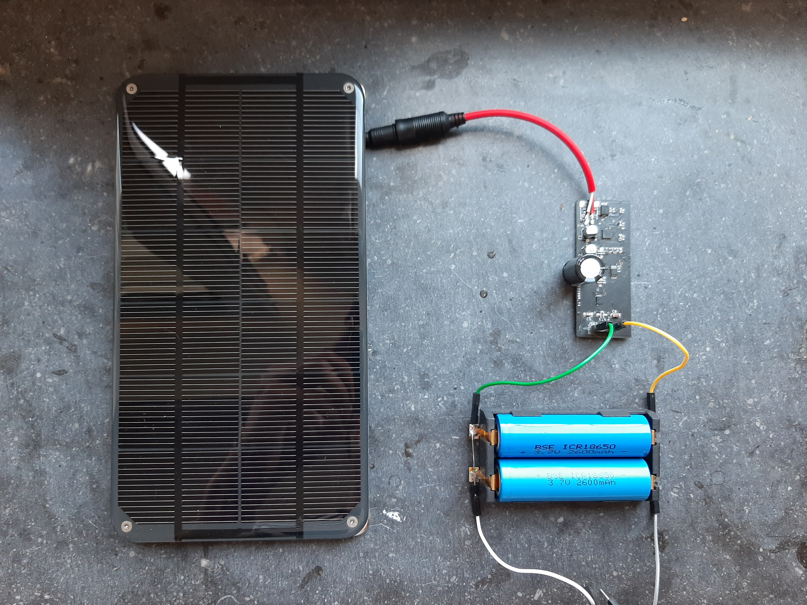

# FinalSolarChargeSystem

Schematic and board of the final solar charge system

## Description

This project is under the MIT License, view it here [MIT license](license.md)

This directory contains the final schematic and board for the battery charge system. It includes the farnell partlist too.

This board is the reproduction of the prototype board.

## Working

Via a solarpanel the batteries are going to charge until they are under 4.2V. When the batteries are fully charged, the circuit will shut down. When the batteries are lower than 4.2V, it wil start charging again. The status of the batteries are read and used to show on the website.

This pcb has the same functionality as the prototype, but all bugs ar out of it.
View this repo and the measurements via following link [devbitParticula](https://particula.devbitapp.be/hardware/#battery-charge-system)

You can find a way to the prototype board here [Prototype](https://github.com/vives-projectwerk-2-2020/BatteryChargeSystem)